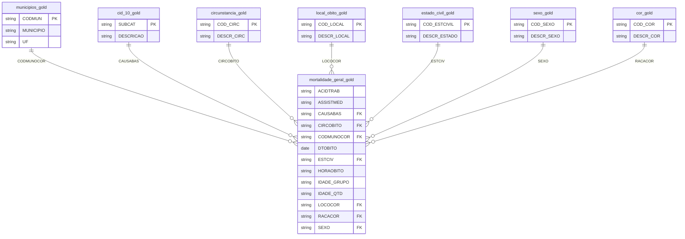

# MVP - Engenharia de Dados Análise de índices de mortalidade no Brasil

# 1️⃣ Objetivo

Este MVP tem como objetivo construir um pipeline de dados na nuvem para analisar dados de mortalidade no Brasil, utilizando tecnologias em nuvem com Databricks e seu Delta Lake. O pipeline envolverá as etapas de busca, coleta, modelagem, carga e análise dos dados, com o propósito de fornecer insights sobre padrões de mortalidade no país.

O problema central que este MVP busca resolver é a falta de uma visão consolidada e acessível dos dados de mortalidade, que permita identificar tendências, anomalias e fatores relevantes para a saúde pública. Para isso, serão respondidas as seguintes perguntas:

1)  Qual o número total de óbitos registrados no Brasil ao longo do tempo?

2)  Quais são as principais causas de morte no Brasil? 

3)  Qual a distribuição da mortalidade por faixa etária? 

4)  Quais são as causas de morte mais comuns entre crianças, adultos e idosos?

5)  O sexo das vítimas influencia as causas da morte?

6)  Houve mudanças nas principal causa de morte ao longo do tempo? 

7)  Qual é a proporção de óbitos que ocorreram em hospitais versus outros locais? 

8)  Qual é a distribuição de óbitos por raça/cor? 

9)  O estado civil tem relação com a mortalidade? 

10) Quais locais apresentam as maiores taxas de mortalidade? 

11) Em quais horários ocorrem mais mortes? 

12) A taxa de homicídios aumentou ou diminuiu ao longo dos anos? 

13) Quais regiões apresentam maior incidência de suicídios?

14) Qual é a distribuição de óbitos por causas relacionadas ao trabalho?

Ao final do projeto, espera-se entregar uma base de dados confiável com análises que contribuam para a compreensão dos fatores que impactam a mortalidade no Brasil.

# 2️⃣ Fonte dos Dados e Coleta

Os dados utilizados neste projeto foram obtidos de fontes oficiais e públicas, portanto há problemas com a confidencialidade destes dados. A base principal é o Sistema de Informações sobre Mortalidade (SIM), que contém registros detalhados sobre óbitos ocorridos no Brasil. Foram coletados os dados entre os anos de 2006 e 2024.

2.1 Tabela Fato – Mortalidade Geral 

A tabela fato do projeto, denominada `mortalidade_geral_gold`, foi construída a partir dos arquivos de mortalidade geral disponibilizados anualmente no portal de dados abertos do SUS:

🔗 Fonte: Sistema de Informações sobre Mortalidade (SIM) – OpenDataSUS (https://opendatasus.saude.gov.br/dataset/sim)

Os arquivos foram baixados manualmente, ano a ano, no formato CSV, e posteriormente feito o upload no DBFS do Databricks. Vale ressaltar que o ano de 2024 é uma prévia, ou seja, não está completo até a data de hoje (11/04/2025), segundo a fonte.

2.2 Tabelas Dimensão

As tabelas dimensão foram obtidas de diferentes fontes, conforme descrito abaixo:

- CID-10: Classificação Internacional de Doenças – 10ª Revisão (`CID_10_gold`)

  Para obter a descrição das causas de morte, foi utilizada a tabela de subcategorias da CID-10, versão 2008, extraída de um arquivo ZIP disponível no portal do Datasus:

  🔗 Fonte: CID-10 – Subcategorias (http://www2.datasus.gov.br/cid10/V2008/descrcsv.htm)

  O arquivo extraído foi o CID-10-SUBCATEGORIAS.CSV, que contém as descrições das subcategorias e categorias da CID-10. Esse conjunto de dados foi escolhido porque apresenta os códigos padronizados utilizados para registrar as causas de óbitos no Brasil.

- Divisão Territorial Brasileira (`municipios_gold`)

  Para relacionar os óbitos às respectivas localidades, foi utilizada a tabela da Divisão Territorial Brasileira 2023, disponibilizada pelo IBGE:

  🔗 Fonte: Divisão Territorial Brasileira – IBGE (https://www.ibge.gov.br/geociencias/organizacao-do-territorio/divisao-regional/23701-divisao-territorial-brasileira.html)

  O arquivo extraído do ZIP foi RELATORIO_DTB_BRASIL_MUNICIPIO.csv, que contém informações sobre regiões geográficas intermediárias e imediatas, municípios, distritos e seus respectivos códigos.

- Demais tabelas dimensão

  As demais tabelas dimensão foram criadas manualmente, pois possuem poucas colunas (apenas 2) e linhas (a maior delas possui apenas 7), tornando viável sua construção sem a necessidade de fontes externas. Foram criadas no formato CSV, separadas por ";", utilizando um editor de texto. Essas tabelas foram baseadas diretamente nas informações contidas na tabela fato `mortalidade_geral_gold` e incluem:

  - Circunstância (`circunstancia_gold`)

  - Raça/Cor (`cor_gold`)

  - Estado Civil (`estado_civil_gold`)

  - Local do Óbito (`local_obito_gold`)

  - Sexo (`sexo_gold`)

  Essas tabelas foram projetadas para servir de referência às respectivas colunas na base de mortalidade geral, garantindo a integridade dos dados no processo analítico.

# 3️⃣ Modelagem e Catálogo de Dados

Para estruturar e organizar os dados de forma eficiente, foi adotado o Esquema Estrela, um dos modelos mais utilizados em Data Warehousing e Business Intelligence.

## 3.1 Estrutura do Esquema Estrela

O esquema estrela do projeto foi construído com uma tabela fato principal contendo os registros de mortalidade e 7 tabelas dimensão para compor as análises. A estrutura ficou organizada da seguinte forma:

 📊 Tabela Fato: `mortalidade_geral_gold`
  
  - Esta tabela contém os registros de óbitos e é o núcleo central do esquema. Cada linha representa um óbito registrado, com detalhes como data, local, causa da morte e características da pessoa falecida.

  📊 Tabelas Dimensão: `municipios_gold`, `cid_10_gold`, `circunstancia_gold`, `local_obito_gold`, `estado_civil_gold`, `sexo_gold` e `cor_gold`.

  - Foram criadas tabelas auxiliares para armazenar descrições de variáveis categóricas e facilitar a análise por meio de junções (joins) entre as tabelas.

## 3.2 Catálogo de Dados

### Tabela `mortalidade_geral_gold`

A tabela fato foi criada a partir da base original do SIM, que continha 132 colunas. Durante o processo de ETL, foram removidos campos irrelevantes, resultando em uma estrutura mais enxuta e otimizada para análise. São eles:

| Campo        | Descrição | Datatype | Tamanho | Valores possíveis | Chave estrangeira |
|--------------|-----------|----------|---------|-------------------|-------------------|
| `ACIDTRAB` | Indica se o evento que desencadeou o óbito está relacionado ao processo de trabalho. | string | 8 | Sim; Não; Ignorado | - |
| `ASSISTMED` | Se refere ao atendimento médico continuado que o paciente recebeu, ou não, durante a enfermidade que ocasionou o óbito. | string | 8 | Sim; Não; Ignorado | - |
| `CAUSABAS` | Código da causa da morte na declaração de óbito. | string | 3 a 4 | Códigos CID-10, ex: 'A012', 'T71', 'U049' | `cid_10_gold.SUBCAT` |
| `CIRCOBITO` | Código do tipo de morte violenta ou circunstâncias em que se deu a morte não natural. | string | 1 | 1; 2; 3; 4; 9 | `circunstancia_gold.COD_CIRC` |
| `CODMUNOCOR` | Código relativo ao município onde ocorreu o óbito. | string | 6 | Códigos numéricos, ex: '110010', '110037', '110020' | `municipios_gold.CODMUN` |
| `DTOBITO` | Data em que ocorreu o óbito. | date | 10 | Datas no formato 'yyyy-mm-dd', ex: '2023-07-15' | - |
| `ESTCIV` | Código da situação conjugal do falecido informada pelos familiares. | string | 1 | 1; 2; 3; 4; 5; 9 | `estado_civil_gold.COD_ESTCIVIL` |
| `HORAOBITO` | Horário do óbito. | string | 5 | Horário no formato de 00(:00) a 23(:59), ex: '08:45' | - |
| `IDADE_GRUPO` |Indica a unidade da idade do falecido em minutos, horas, dias, meses ou anos:  se 0 = minuto;  se 1 = hora,  se 2 = dia;  se 3= mês;  se 4 = ano;  se 5 = idade maior que 100 anos;  se 9 = ignorado. | string | 1 | 0; 1; 2; 3; 4; 5; 9 | - |
| `IDADE_QTD` | Indica a quantidade de unidades da idade do falecido:  Idade menor de 1 hora: campo varia de  01 a 59  (minutos);  De 1 a 23 horas: campo varia de 01 a 23 (horas);  De 24 horas a 29 dias: campo varia de 01 a 29 (dias);  De 1 mês a menos de 12 meses completos: campo varia de 01 a 11 (meses);  Anos: campo varia de 00 a 99;  Maior que 100: campo varia de 00 a 50;  Ignorado: 99. | string | 2 | 00 a 99, conforme a unidade | - |
| `LOCOCOR` | Código do local de ocorrência do óbito. | string | 1 | 1; 2; 3; 4; 5; 6; 9 | `local_obito_gold.COD_LOCAL` |
| `RACACOR` | Código da cor informada pelo responsável pelas informações do falecido. | string | 1 | 1; 2; 3; 4; 5; 9 | `cor_gold.COD_COR` |
| `SEXO` | Código do sexo do falecido. | string | 1 | 1; 2; 9 | `sexo_gold.COD_SEXO` |
___

### Tabela `cid_10_gold`

Relaciona os códigos da CID-10 com a descrição das doenças e causas de mortalidade. Sua colunas são:

| PK  | Nome da Coluna | Descrição | Datatype | Tamanho | Valores Possíveis | Relacionamento |
|-----|---------------|-----------|---------|---------|------------------|---------------|
| ✅  | `SUBCAT` | Código da causa da morte na declaração de óbito. | string | 3 a 4 | Códigos CID-10, onde o primeiro caractere é uma letra e o restante um número, por exemplo: 'A012', 'T71' e 'U049'. | `mortalidade_geral.CAUSABAS = cid_10.SUBCAT` |
|     | `DESCRICAO` | Descrição da causa da morte na declaração de óbito. | string | 5 a 114 | Exemplos: 'Cólera devida a Vibrio cholerae 01, biótipo cholerae', 'Febre paratifóide A', 'Botulismo'. | - |

___

### Tabela `circunstancia_gold`

Relaciona o código do tipo de morte com sua descrição. Suas colunas são:

### Tabela: circunstancia

| PK  | Nome da Coluna | Descrição | Datatype | Tamanho | Valores Possíveis | Relacionamento |
|-----|---------------|-----------|---------|---------|------------------|---------------|
| ✅  | `COD_CIRC` | Código do tipo de morte violenta ou circunstâncias em que se deu a morte não natural. | string | 1 | 1; 2; 3; 4; 9 | `mortalidade_geral.CIRCOBITO = circunstancia.COD_CIRC` |
|     | `DESCR_CIRC` | Descrição do tipo de morte. | string | 6 a 9 | acidente, suicídio, homicídio, outras circunstâncias, ignorado | - |

___

### Tabela `municipios_gold`

Contém os códigos e nomes dos municípios e estados do Brasil. Suas colunas são:

| PK  | Nome da Coluna | Descrição | Datatype | Tamanho | Valores Possíveis | Relacionamento |
|-----|---------------|-----------|---------|---------|------------------|---------------|
| ✅  | `CODMUN` | Código relativo ao município onde ocorreu o óbito. | string | 6 | códigos numéricos, ex: '110010', '110037', '110020' | `mortalidade_geral.CODMUNOCOR = municipios.CODMUN` |
|     | `MUNICIPIO` | Nome do município onde ocorreu o óbito. | string | 3 a 32 | ex: Guajará-Mirim, Alto Alegre dos Parecis, Rio de Janeiro | - |
|     | `UF` | Código do estado onde ocorreu o óbito. | string | 2 | ex: RJ, SP, MG | - |

___

### Tabela `estado_civil_gold`

Armazena o código e sua descrição de estado civil. Suas colunas são:

| PK  | Nome da Coluna      | Descrição                                                    | Datatype | Tamanho  | Valores Possíveis                                            | Relacionamento |
|-----|---------------------|--------------------------------------------------------------|----------|----------|-------------------------------------------------------------|---------------|
| ✅  | `COD_ESTCIVIL`      | Código da situação conjugal do falecido informada pelos familiares. | string   | 1        | 1; 2; 3; 4; 5; 9                                            | `mortalidade_geral.ESTCIV = estado_civil.COD_ESTCIVIL` |
|     | `DESCR_ESTADO`      | Descrição da situação conjugal do falecido informada pelos familiares. | string   | 5 a 33   | Solteiro; Casado; Viúvo; Separado judicialmente/divorciado; União estável; Ignorado. | - |
___

### Tabela `sexo_gold`

Relaciona o sexo do falecido com seu código. Suas colunas são:

| PK  | Nome da Coluna  | Descrição                        | Datatype | Tamanho  | Valores Possíveis               | Relacionamento |
|-----|---------------|--------------------------------|----------|----------|--------------------------------|---------------|
| ✅  | `COD_SEXO`    | Código do sexo do falecido.   | string   | 1        | 1; 2; 9                        | `mortalidade_geral.SEXO = sexo.COD_SEXO` |
|     | `DESCR_SEXO`  | Sexo do falecido.             | string   | 8 a 9    | Masculino; Feminino; Ignorado  | - |

___

### Tabela `cor_gold`

Relaciona a raça/cor do falecido com seu código. Suas colunas são:

| PK  | Nome da Coluna  | Descrição                                                  | Datatype | Tamanho  | Valores Possíveis                 | Relacionamento |
|-----|---------------|------------------------------------------------|----------|----------|--------------------------------|---------------|
| ✅  | `COD_COR`    | Código da cor informada pelo responsável pelas informações do falecido. | string   | 1        | 1; 2; 3; 4; 5; 9                 | `mortalidade_geral.RACACOR = cor.COD_COR` |
|     | `DESCR_COR`  | Cor/raça do falecido.                           | string   | 5 a 9    | Branca; Preta; Amarela; Parda; Indígena | - |

___

### Tabela `local_obito_gold`

Relaciona o código do local de óbito com sua descrição. Suas colunas são:

| PK  | Nome da Coluna  | Descrição                                  | Datatype | Tamanho  | Valores Possíveis                                         | Relacionamento |
|-----|---------------|--------------------------------|----------|----------|------------------------------------------------|---------------|
| ✅  | `COD_LOCAL`  | Código do local de ocorrência do óbito. | string   | 1        | 1; 2; 3; 4; 5; 6; 9                               | `mortalidade_geral.LOCOCOR = local_obito.COD_LOCAL` |
|     | `DESCR_LOCAL` | Descrição do local de óbito.         | string   | 6 a 32   | Hospital; Outros estabelecimentos de saúde; Domicílio; Via pública; Outros; Aldeia indígena; Ignorado | - |

_____

## 3.3 Diagrama Entidade Relacionamento

# 4️⃣ Carga
Esta seção está dentro do notebook.

# 5️⃣ Análise
Esta seção está dentro do notebook.

# 6️⃣ Autoavaliação

## 6.1 Atingimento dos Objetivos
  O objetivo principal deste projeto foi a construção de um pipeline de dados na nuvem utilizando o Databricks, desde a ingestão até a análise dos dados de mortalidade no Brasil, extraídos do Sistema de Informações sobre Mortalidade (SIM). Para isso, fizemos:
  
  - As etapas de busca e coleta dos dados necessários na internet;
  - Modelamos esses dados em um esquema estrela, com uma tabela fato e sete tabelas dimensões, demonstrando esse esquema com um Diagrama Entidade Relacionamento e com um Catálogo de Dados para cada tabela;
  - Carregamos os dados no Databricks e transformamo-los em tabelas Delta, facilitando seu manuseio atráves do Delta Lake e uso do Spark e consultas SQL;
  - Fizemos análises dos dados e respondemos todas as perguntas elencadas no início do projeto através da união de queries SQL e demonstrações gráficas usando as bibliotecas Matplotlib e Seaborn, trazendo uma visão consolidada e acessível dos dados de mortalidade no Brasil, que era o problema central que este MVP buscava resolver.

  Dito isso, acredito que os objetivos delineados no início do projeto foram atingidos com sucesso. No entanto, algumas melhorias podem ser feitas para aumentar ainda mais o impacto do trabalho, conforme será explicitado na seção 6.3.

  Por fim, posso dizer que este projeto proporcionou uma experiência prática enriquecedora com o uso de Databricks e suas funcionalidades, modelagem de dados e análise exploratória de grandes volumes de dados. 

## 6.2 Dificuldades Encontradas
  As dificuldades encontradas no projeto foram básicamente sobre o tratamento dos dados, discorridos na seção 5.A - Qualidade dos dados. Em suma o dataset do SIM é disponibilizado sem um refinamento dos dados antes, possuindo valores não condizentes com com os esperados em suas colunas.

  Apesar disso, esse tratamento dos dados é esperado em qualquer projeto de análise de dados, portanto não pode-se se chamar exatamente de uma dificuldade, porém foi o único ponto a ser abordado como mais próximo de uma dificuldade.

## 6.3 Trabalhos Futuros
O projeto pode ser aprimorado da seguinte forma:

- Aumentar a base de dados:

  O SIM tem um registro de óbitos no Brasil desde 1979. Seria interessante expandir essa base ao projeto, tendo assim uma disponibilidade maior de informações, e consequentemente, melhores insights sobre a evolução da taxa de mortalidade no país.

- Automação do Pipeline:

  Automatizar a ingestão dos dados, criando um processo de ingestão e atualização contínua dos dados.

- Dashboard Interativo:

  Criar uma interface visual interativa em um software que sirva para essa finalidade, como por exemplo, o Microsoft Power BI, facilitando a exploração dos dados por diferentes públicos.

- Implementação de Modelos Preditivos:

  Utilizar Machine Learning para prever padrões de mortalidade com base em variáveis históricas.
